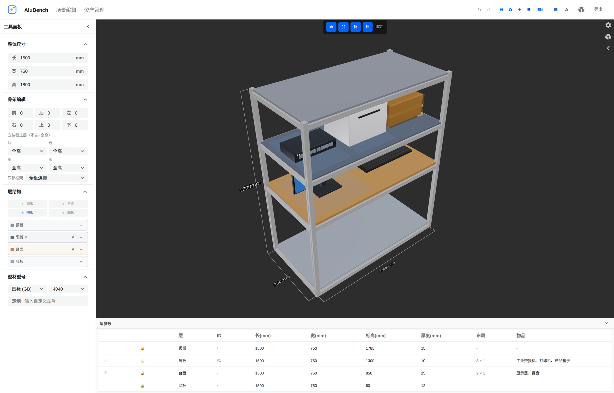
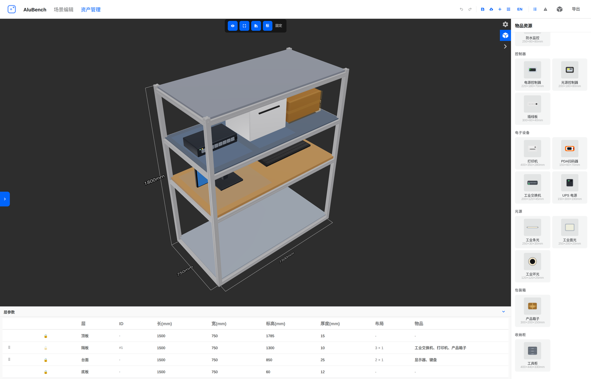
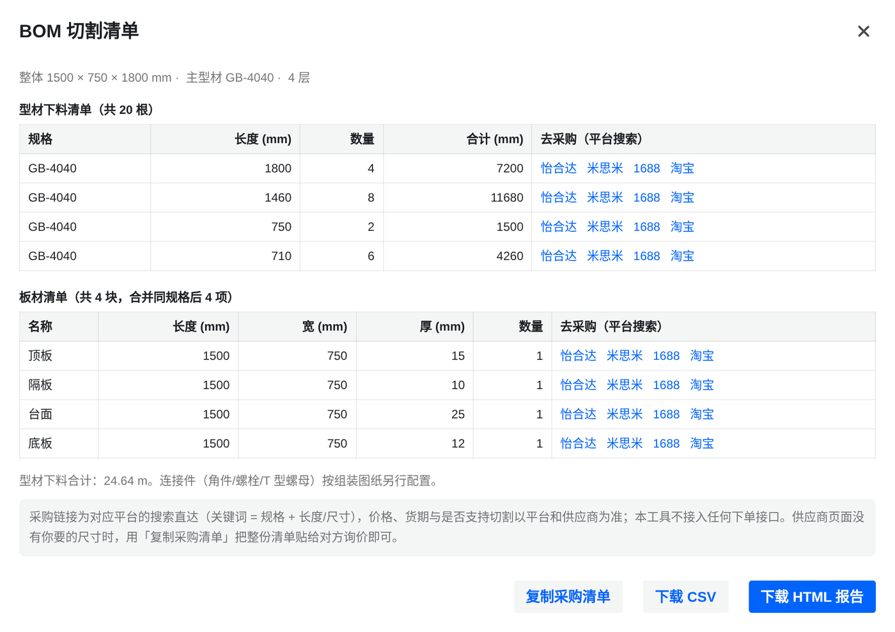
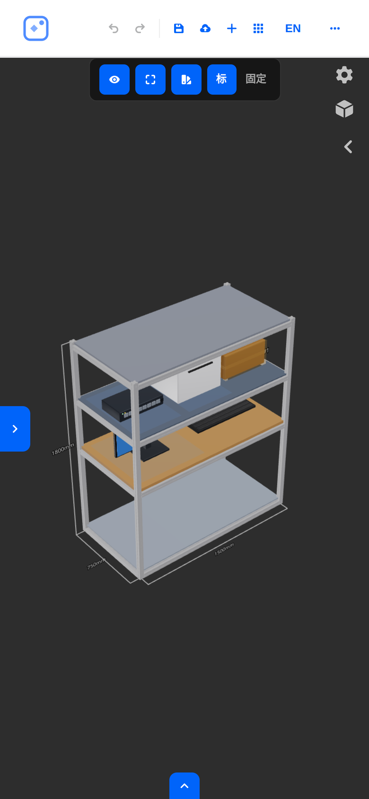

<div align="center">

# AluBench

**铝型材工作台 3D 设计器** · 3D Designer for Aluminium Profile Workbenches

在浏览器里画出铝型材机架，直接拿到下料清单与采购入口。

纯前端 · 无后端 · 数据不出本机 · 离线可用 · PC / 平板 / 手机

[](https://github.com/Zhong-master/alubench/actions/workflows/ci.yml)
[](LICENSE)
[](#快速开始)



</div>

## 这是什么

AluBench 是一个**纯前端的 3D 铝型材工作台设计器**：选好型材规格与机架尺寸，摆上顶板 / 台面 / 隔板 / 底板和台面上的工控机、显示器、光源等设备，立刻得到一张**可下料、可询价**的物料清单。

- 不用装 CAD —— 打开浏览器就能画；
- 不用连服务器 —— 工程数据只存在你自己的浏览器里；
- 不用手算 —— BOM（切割清单）由几何内核直接算出。

## 能做什么

|            |                                                                                                                                   |
| ---------- | --------------------------------------------------------------------------------------------------------------------------------- |
| **搭骨架** | T 型槽铝型材，国标 / 欧标，2020–8080 规格；各面立柱数量、底框模式、立柱截止层可调                                                  |
| **排层板** | 顶板 / 台面 / 隔板 / 底板；逐层设长宽、标高、厚度、网格布局、加强筋、连接方式，隔板还可单独指定边框型材                             |
| **放设备** | 19 种设备模型、7 个分类（工控机、显示器、相机、光源、UPS、交换机、工具柜…）；放置后可缩放 / 旋转 / 翻转，按层间净空自动适配         |
| **出图纸** | 一键导出**自包含 HTML**（内嵌 three.js，约 640 KB）：断网、发给同事、归档都能打开，含尺寸标注与层 ID 分组                           |
| **下料采购** | BOM 切割清单（型材 规格 × 长度 × 数量，板材同规格自动合并）→ 导出 CSV / 打印 HTML / 生成怡合达 · 米思米 · 1688 · 淘宝搜索直达链接      |
| **查问题** | 自动校验：层板越界 / 超高、层间重叠、物品超出网格单元、物品顶部穿透上方层板                                                          |

## 界面

物品库（19 种设备，缩略图实时生成）与 BOM 切割清单：

<p>
  
  
</p>

界面支持中英双语一键切换（语言只影响显示，不会改写工程数据）：


手机 / 平板同样可用 —— 窄屏自动切换为抽屉式面板与触摸排序：



## 快速开始

### 方式一：Docker（一条命令）

```bash
docker compose up -d --build
# 打开 http://localhost:5173
```

镜像约 77 MB（多阶段构建 → nginx 静态托管）。容器无状态：工程数据都在浏览器里，重建 / 升级 / 换机器都不丢。

### 方式二：npm 包

```bash
npx alubench                              # 起本地服务（默认 http://localhost:5173）
npx alubench --port 8080 --host 0.0.0.0   # 换端口 / 供内网同事访问
npm i -g alubench && alubench --open      # 或全局安装后长期使用
```

包内自带构建产物，**零运行时依赖**（需 Node ≥ 18），不需要 Docker，也不需要本机构建工具链。

> npm 上架流程还在准备中；在那之前用方式一或方式三。

### 方式三：源码

```bash
npm install
npm run dev        # 开发服务器 http://localhost:5173
npm run build      # 生产构建 → dist/
npm run check      # 质量门：ESLint + 类型检查 + 单测 + 构建
```

### 装到桌面 / 手机主屏（PWA）

用 Chrome / Edge / Safari 打开后选择「安装到桌面」，之后可离线打开。需要 `localhost` 或 HTTPS —— **用局域网 IP 以纯 HTTP 访问时不会注册**（浏览器的安全上下文要求）。

## 典型流程

1. 左侧填机架长宽高、选型材规格；
2. 加层：顶板 / 台面 / 隔板 / 底板，逐层调标高与布局网格；
3. 右侧「物品资源」把设备放到层上，调大小与朝向；
4. 顶栏清单按钮打开 BOM，核对下料后可复制清单或直接点平台搜索；
5. 「导出独立 HTML」存档或发给同事。

## 已知限制

- **不接下单接口**：采购环节只提供各平台的搜索深链。1688 / 淘宝 / 怡合达 / 米思米的正式对接均需商家资质，公开免费的下单 API 并不存在；搜索关键词固定为中文（四个平台都是中文站点）。
- **没有云端协作**：无账号体系、无多人协作、无云端保存；工程以 `.json` 文件在本地流转。
- **BOM 仅供设计参考**：下料与下单前请按实际型材与加工工艺复核。
- 首屏 JS 约 540 KB（gzip），导出模块按需单独加载（约 163 KB gzip）。

## 技术栈

Vite 8 · TypeScript 6 · React 19 · Three.js（@react-three/fiber + drei）· Semi Design · vitest（118 条单测）

场景几何只有一份实现（`src/geometry/`），3D 视图、导出、BOM 三端消费同一份数据，避免多端结果漂移。架构说明与硬性约定见 [CLAUDE.md](CLAUDE.md)。

## 授权

[CC BY-NC-SA 4.0](LICENSE) © 2026 Zhong-master

- ✅ 个人学习、内部评估、非商业用途的部署与二次开发
- 📌 需**署名**（保留版权声明）、**非商业性使用**、衍生作品**相同方式共享**
- 💼 **商业使用需另行授权**：damowangazhong@gmail.com

> CC 系列并非软件专用协议（不含专利授权条款）。若你的目标是「可商用、但衍生必须开源」，AGPL-3.0 更贴合软件场景。

## 贡献

Issue 与 PR 都欢迎。动手前建议先扫一遍 [CLAUDE.md](CLAUDE.md) 的「硬性约定」—— 那里记录了若干反直觉但必要的规定（例如所有数值输入必须走 `DeferredNumberInput`），改错会静默破坏用户数据。
